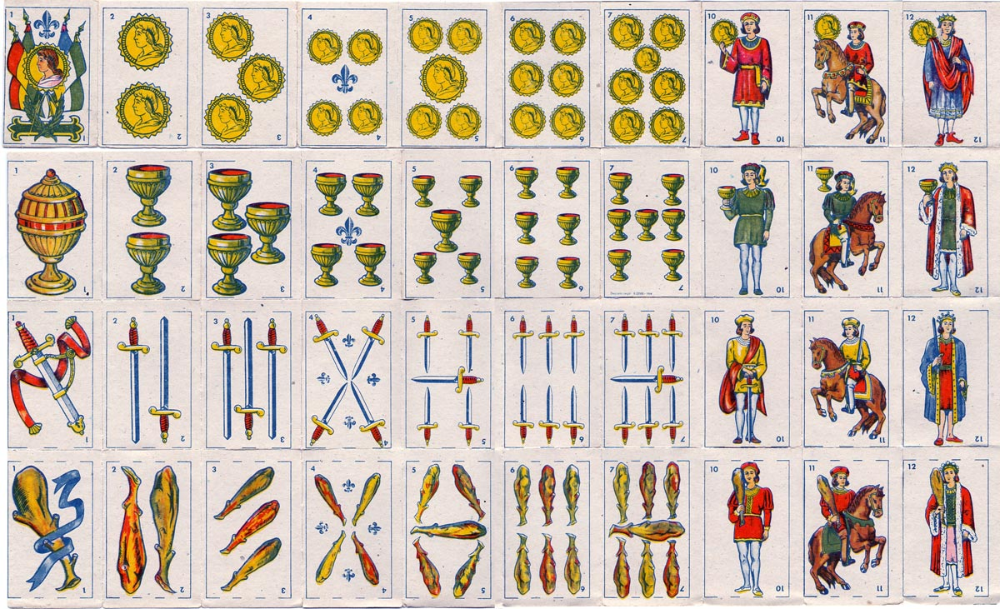

# Truco



# Libraries

## Linux

```
sudo apt install libsdl2-dev
sudo apt install libsdl2-image-dev
```

## Windows

<a href="https://www.libsdl.org/download-2.0.php"> SDL 2.0 </a> </br>
<a href="https://www.libsdl.org/projects/SDL_image/"> SDL Image 2.0 </a>

# Compiling

Compile using c++17

## License

[MIT](https://choosealicense.com/licenses/mit/)
